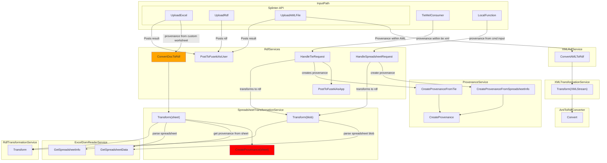

```mermaid
graph TB
    subgraph InputPath
        TieMelConsumer
        LocalFunction

        subgraph Splinter-API
        UploadExcel
        UploadRdf
        UploadAMLFile
        end
    end

    subgraph RdfServices
        ConvertDocToRdf
        HandleTieRequest --> PostToFusekiAsApp
        HandleSpreadsheetRequest
        PostToFusekiAsUser
    end

    subgraph XMLRdfService
        ConvertAMLToRdf
    end

    TieMelConsumer -- provenance within tie xml--> HandleTieRequest
    LocalFunction -- provenance from cmd input --> HandleSpreadsheetRequest
    UploadExcel -- provenance from custom worksheet --> ConvertDocToRdf
    style ConvertDocToRdf fill:orange
    UploadExcel -- Posts result --> PostToFusekiAsUser
    UploadRdf -- Posts rdf --> PostToFusekiAsUser
    UploadAMLFile -- Provenance within AML --> ConvertAMLToRdf
    UploadAMLFile -- Posts result --> PostToFusekiAsUser

    subgraph ProvenanceService
        CreateProvenanceFromTie --> CreateProvenance
        CreateProvenanceFromSpreadsheetInfo --> CreateProvenance
    end

    HandleTieRequest --creates provenance-->CreateProvenanceFromTie
    HandleTieRequest --transforms to rdf --->Transform_Blob
    HandleSpreadsheetRequest --create provenance-->CreateProvenanceFromSpreadsheetInfo
    HandleSpreadsheetRequest --transforms to rdf --->Transform_Blob
    ConvertDocToRdf --> Transform_Sheet

    subgraph SpreadsheetTransformationService
        Transform_Blob["Transform(blob)"]
        Transform_Sheet["Transform(sheet)"] -->CreateProvenance_Sheet["CreateProvenance(sheet)"]
        style CreateProvenance_Sheet fill:red
    end

    Transform_Blob --parse spreadsheet blob --> GetSpreadsheetData
    Transform_Sheet --get provenance from sheet --> GetSpreadsheetInfo
    Transform_Sheet --parse spreadsheet --> GetSpreadsheetData

    subgraph ExcelDomReaderService
        GetSpreadsheetInfo
        GetSpreadsheetData
    end

    Transform_Blob --> Transform
    Transform_Sheet --> Transform

    subgraph RdfTransformationService
        Transform
    end

    ConvertAMLToRdf --> Transform_XML
    subgraph XMLTransformationService
        Transform_XML["Transform(XMLStream)"]
    end

    Transform_XML --> Convert
    subgraph AmlToRdfConverter
        Convert
    end 
```