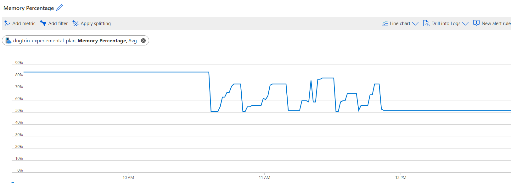

# Fuseki performance test

## Background
The development of more complex ontologies and the increase in data left us in a situation where the MER app took a performance hit. The backing Fuseki was persisted, with the OWL Full reasoner enabled, and ran on a P1V1 service plan (3.5 GB memory). Queries that previously performed well where now sluggish and there where cases of them timing out.

On a local, in-memory, Fuseki running on 4 GB memory the queries still worked as expected. Trying to upload the dataset to an in-memory Fuseki on Azure running on P1V1 failed. Several strategies for uploading the data was tried. The dataset was divided in smaller chunks and uploaded in different sequences, but in all cases the Fuseki instance crashed when the total amount of triples surpassed 2 millions.

2 million triples are just a fraction of what we need.

## Possible performance improvements
According to the Fuseki [documentation](https://jena.apache.org/documentation/inference/#OWLnotes) the OWL Full reasoner is 3 - 4 times slower than the RDFS reasoner, which is in itself an extension of the pure Transitive reasoner. This leads to the following 3 performance improvement strategies:

1. Switch to RDFS reasoner. The same dataset as for the OWL Full reasoning is used.
2. Switch to Transitive reasoner. The same dataset as for the OWL Full reasoning is used.
3. Remove reasoning. A new dataset is created where the need for transitive reasoning is constructed away, i.e. predicates from the Excel spreadsheets are replaced with predicates from the MEL and Shipweight ontologies

## Fuseki configuration
The tests were run on a persisted Fuseki running a P2V2 service plan. This enabled us to run the original OWL Full setup as a benchmark. 

## Caveats
The tests are performed on the dugtrio-experimental-plan. Both dugtriofuseki-dev and dugtriofuseki-test are running on this plan, and dugtriofuseki-test is actively used in the MER development. This may have impacted the results.  

## Test results
The test results are reported as **Query** time (curl's "time_starttransfer" - "time_pretransfer")  and **Total** time (curl's "time_total). The actual queries run are listed at the end of this document.

All the queries were run 5 times for each test case and the results are given in the table below. The transient reasoner has been omitted as it was unable to produce the transitive closure we need.

|                                    | Count (#) |   Count(s)  |    Count(s)        | Metadata/tags (s) |    Metadata/tags (s)         | Projects/References (s) |      Projects/References (s)        | Benchmarks/Plots (s) |       Benchmarks/Plots (s)      | Benchmark/Tags |     Benchmark/Tags      |
|------------------------------------|:---------:|:-----------:|:----------:|:-----------------:|:----------:|:-----------------------:|:-----------:|:--------------------:|:----------:|:--------------:|:---------:|
|                                    |           |    Query    |    Total   |       Query       |    Total   |          Query          |    Total    |         Query        |    Total   |      Query     |   Total   |
| Dugtriofuseki - DEV       OWL Full | 2275190   | 8.061648    | 8.263834   | 0.133027          | 0.371843   | 0.094723                | 0.321595    | 8.58532              | 8.793088   | 0.056691       | 0.252264  |
|                                    | 2275190   | 6.412048    | 6.58187    | 0.051131          | 0.243165   | 0.053163                | 0.262188    | 2.623164             | 2.816513   | 0.047894       | 0.258525  |
|                                    | 2275190   | 14.69953    | 14.876129  | 0.059229          | 0.255377   | 0.067887                | 0.309429    | 1.902781             | 2.087624   | 0.057208       | 0.246083  |
|                                    | 2275190   | 6.800713    | 6.974825   | 0.044425          | 0.248278   | 0.046756                | 0.256024    | 1.830401             | 2.040776   | 0.04848        | 0.2386    |
|                                    | 2275190   | 11.599638   | 11.805567  | 0.049064          | 0.271037   | 0.049912                | 0.192386    | 2.024632             | 2.232218   | 0.055322       | 0.238463  |
| Avgerage                           | 2275190   | 8.99348475  | 9.1741645  | 0.071953          | 0.27966575 | 0.06563225              | 0.287309    | 3.7354165            | 3.93450025 | 0.05256825     | 0.248868  |
| Median                             | 2275190   | 8.061648    | 8.263834   | 0.051131          | 0.255377   | 0.053163                | 0.262188    | 2.024632             | 2.232218   | 0.055322       | 0.246083  |
|                                    |           |             |            |                   |            |                         |             |                      |            |                |           |
|   Dugtriofuseki - DEV       RDFS   | 2182056   | 20.067029   | 20.263052  | 0.086044          | 0.305974   | 0.952273                | 1.206218    | 8.127438             | 8.342316   | 0.135077       | 0.386528  |
|                                    | 2182056   | 5.087724    | 5.307365   | 9.312099          | 9.517139   | 0.081647                | 0.298291    | 17.604945            | 17.802768  | 0.068621       | 0.223245  |
|                                    | 2182056   | 4.885962    | 5.10838    | 0.097082          | 0.296827   | 0.073143                | 0.357903    | 1.989287             | 2.161606   | 0.079837       | 0.261152  |
|                                    | 2182056   | 5.142497    | 5.33466    | 0.090781          | 0.29418    | 0.063882                | 0.256839    | 1.86424              | 2.059724   | 0.071706       | 0.315553  |
|                                    | 2182056   | 5.26424     | 5.495809   | 0.092686          | 0.306469   | 0.08752                 | 0.258377    | 1.515184             | 1.754649   | 0.088356       | 0.295009  |
| Avgerage                           | 2182056   | 8.795803    | 8.3018532  | 2.3965015         | 2.1441178  | 0.29273625              | 0.52981275  | 7.3964775            | 7.5916035  | 0.08881025     | 0.2966195 |
| Median                             | 2182056   | 5.142497    | 5.33466    | 0.092686          | 0.305974   | 0.081647                | 0.298291    | 1.989287             | 2.161606   | 0.079837       | 0.295009  |
|                                    |           |             |            |                   |            |                         |             |                      |            |                |           |
|   Dugtriofuseki - DEV       None   | 966248    | 0.665713    | 0.80388    | 0.332282          | 0.513786   | 46.415088               | 46.614303   | 7.68952              | 7.870571   | 1.037331       | 1.236707  |
|                                    | 966248    | 0.604957    | 0.810261   | 0.067982          | 0.259785   | 0.097708                | 0.412884    | 1.725376             | 1.939405   | 0.105499       | 0.317     |
|                                    | 966248    | 63.868055   | 64.058734  | 0.064478          | 0.256732   | 0.100984                | 0.318746    | 1.967913             | 2.167702   | 0.160048       | 0.395198  |
|                                    | 966248    | 0.606722    | 0.80988    | 0.059079          | 0.384634   | 0.121639                | 0.407882    | 1.617537             | 1.823677   | 0.103049       | 0.308629  |
|                                    | 966248    | 1.197437    | 1.368521   | 0.079522          | 0.290095   | 0.085735                | 0.300236    | 1.474666             | 1.571073   | 0.13714        | 0.321753  |
| Avgerage                           | 966248    | 16.43636175 | 13.5702552 | 0.13095525        | 0.3410064  | 11.68385475             | 11.93845375 | 3.2500865            | 3.45033875 | 0.35148175     | 0.5158574 |
| Median                             | 966248    | 0.665713    | 0.810261   | 0.067982          | 0.290095   | 0.100984                | 0.407882    | 1.725376             | 1.939405   | 0.13714        | 0.321753  |

The first column lists the total number of triples in the Fuseki. The OWL Full reasoning generates about 93 K more triples than the RDFS reasoner, while the mapping from the Excel template to the ontology more than doubles the number of triples. In all cases, the number of triples we upload is about the no-reasoning set, and then the Fuseki materialize triples based on the reasoning rules given. When restarting a persisted Fuseki running a Full OWL reasoner with a RDFS reasoner, the materialized triples are removed and rematerialized using the new reasoner.  

For the OWL reasoner, it was expected that the first execution of all queries were slower than the consecutive ones, because the inferred graph will be computed and cached on the first execution. This means that materialize triples are kept in memory and not persisted. The data is not conclusive in this regard as the first runs of the *count* and *benchmark/tags* queries are faster than later executions. It should be mentioned that running the OWL reasoner on the test dataset timed out several times before managing to establish a stable test environment. It could be that parts of the graph where already cached when the reported testing began.   

It was expected that the RDFS reasoner did something similar, but for a couple of queries, the second execution takes longer. With reasoning turned off it was expected that the this first step delay should disappear altogether, but there seems to be some calculation / caching also in this case. Some of the queries also had executions with abnormally long execution times. It may be false positives, but it is something that should be monitored going forward. Due to these outliers it makes more sense to compare median rather than average values.

Comparing median values for "quick" queries, less than 500 ms, the OWL reasoning performs slightly better than RDFS reasoning, which again performs slightly better than no reasoning. For longer queries, no reasoning performs better. Of course there is only about half the triples in the no reasoning dataset, but the count query is about 10 times faster. On the other hand, the more complex benchmark-plot query are only slightly better.

An additional factor is the memory usage, shown in the image below. At the beginning the memory consumption is fairly constant about 85%. This is the OWL Full memory consumption, and running a query have little impact on the overall memory consumption. Of course, there is a fair chance that this consumption is erroneous. After restarting the Fuseki the next two peaks are the queries executed with the RDFS reasoner. The memory baseline consumption is about 50% with peak consumption of about 75%. Finally the Fuseki is restarted with no reasoning, which means we need to upload the dataset directly represented by the ontologies. The third peak-set is the queries deleting the existing data and uploading the new set. The final two peaks are the execution of the various queries without reasoning. The peaks are similar to the case for RDFS reasoning, but slightly smaller.   

## Conclusion
The Full OWL reasoner is known to have performance issues and a high memory consumption. The other strategies have consume less memory and performs better, at least for the heavier queries.

The biggest takeaway is that our current queries do *not* require reasoning when the data is expressed using our ontologies. 

The current performance issue, that triggered this work, has been solved by simply change the reasoner to RDFS, but we have not found the performance boundaries for the Fuseki. More work should be performed to find these limits, because somewhere down the line this issue will resurface. 

## Future work
The time has come to optimization the data model to use the ontologies directly and not reason around the source vocabularies. This can be achieved in different ways. We can either store source data and use them to construct "clean" dataset, only using the ontologies, or we can directly transform to an ontology representation and only keep provenance information about the source. In the future the need for transformations will depend on the contractors and their ability to deliver rdf. 

Related work are being done with grouping datasets in named graphs. It is therefore also time to investigate these constructs' impact on performance. More work should be performed to find the performance limits of the Fuseki.   